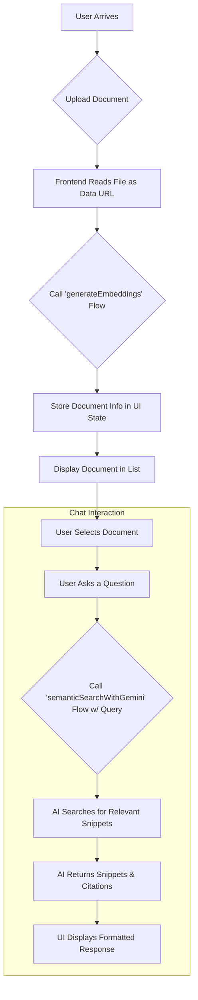

# DocuChat AI

DocuChat AI is a full-stack application that allows users to upload their documents and engage in an intelligent conversation about their content. Built with a modern tech stack, it leverages the power of generative AI to perform semantic searches on documents, providing users with relevant information along with source citations.

## Application Flow

The diagram below illustrates the end-to-end user and data flow, from document upload to receiving an AI-generated response.



---

## Features

-   **Document Upload**: Securely upload documents in PDF, TXT, or MD format.
-   **Interactive Chat Interface**: A clean and intuitive chat panel to interact with the AI.
-   **AI-Powered Semantic Search**: Utilizes the Google Gemini model via Genkit to understand the context of your query and find the most relevant information within the selected document.
-   **Source Citations**: Each AI response is backed by citations from the source document. Hover over a citation to see the exact text snippet it refers to.
-   **Responsive Design**: A seamless experience across desktop and mobile devices, featuring a collapsible sidebar that transforms into an off-canvas menu on smaller screens.
-   **Modern UI**: Built with ShadCN UI components and styled with Tailwind CSS for a professional look and feel.

## Tech Stack

-   **Framework**: [Next.js](https://nextjs.org/) (App Router)
-   **Language**: [TypeScript](https://www.typescriptlang.org/)
-   **AI/Generative**: [Genkit](https://firebase.google.com/docs/genkit) with the [Google AI Plugin](https://www.npmjs.com/package/@genkit-ai/googleai)
-   **Styling**: [Tailwind CSS](https://tailwindcss.com/)
-   **UI Components**: [ShadCN UI](https://ui.shadcn.com/), [Lucide React](https://lucide.dev/guide/packages/lucide-react) (for icons)
-   **State Management**: React Hooks (`useState`, `useEffect`, `useContext`)

---

## Project Structure

The project is organized into the following key directories:

```
/src
├── app/          # Next.js App Router pages and layout
├── ai/           # Genkit flows for AI functionality
│   ├── flows/
│   └── genkit.ts # Genkit initialization
├── components/   # Reusable React components
│   ├── chat/
│   ├── doc-upload/
│   ├── layout/
│   └── ui/       # ShadCN UI components
├── hooks/        # Custom React hooks
├── lib/          # Utility functions and type definitions
└── ...
```

## Getting Started

To get the project up and running on your local machine, follow these steps.

### Prerequisites

-   Node.js (v18 or later)
-   npm or yarn

### Installation

1.  **Clone the repository:**
    ```bash
    git clone <repository-url>
    cd <repository-name>
    ```

2.  **Install dependencies:**
    ```bash
    npm install
    ```

3.  **Set up environment variables:**
    Create a `.env` file in the root of the project and add your Google AI API key:
    ```env
    GEMINI_API_KEY=your_google_ai_api_key_here
    ```

### Running the Application

1.  **Start the Genkit development server:**
    Open a terminal and run:
    ```bash
    npm run genkit:watch
    ```
    This will start the Genkit flows and watch for any changes.

2.  **Start the Next.js development server:**
    In a separate terminal, run:
    ```bash
    npm run dev
    ```

The application should now be running at `http://localhost:9002`.
